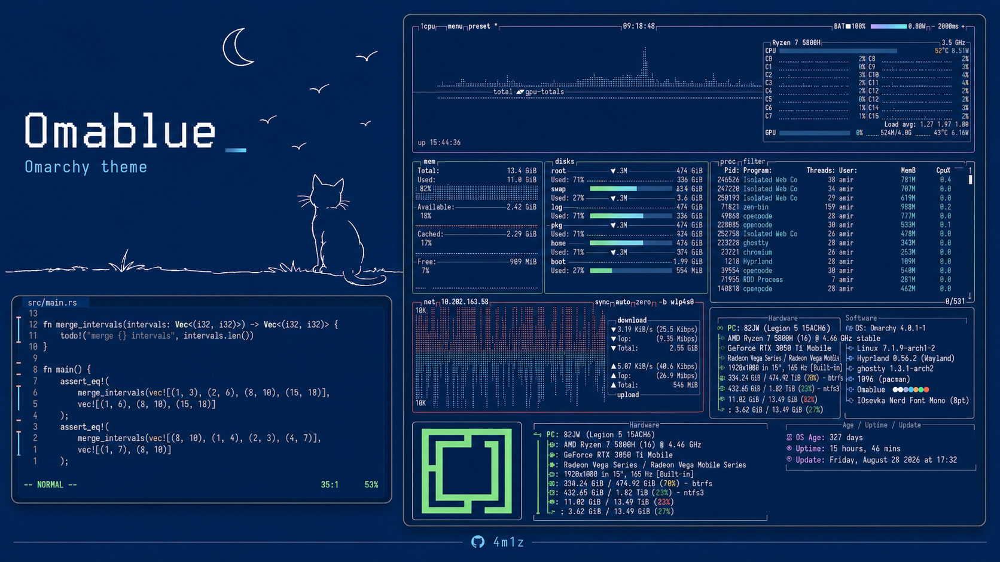

# OmaBlue

A crisp blue-and-white theme for [Omarchy](https://omarchy.org/), inspired by
the classic Windows PowerShell console.



## Highlights

- Classic PowerShell blue `#012456` surfaces
- High-contrast white foreground text
- Readable ANSI colors tuned for the blue background
- White-to-blue active window borders
- Three blue-and-white illustrated wallpapers
- Automatic themes for Omarchy-supported terminals and applications

The cat-and-moon wallpaper is selected by default. Use the Omarchy background
switcher to cycle through the two bird-and-landscape alternatives.

## Installation

```sh
omarchy theme install https://github.com/4m1z/omablue.git
```

The installer clones the repository and applies the theme. To select it again
later, run:

```sh
omarchy theme set omablue
```

## Palette

| Role | Color |
| --- | --- |
| Background | `#012456` |
| Foreground | `#FFFFFF` |
| Selection | `#2A5A8F` |
| Muted | `#7BA2C7` |
| Red | `#FF7B72` |
| Green | `#7EE787` |
| Yellow | `#FFD166` |
| Blue | `#73B7FF` |
| Magenta | `#D6A8FF` |
| Cyan | `#72E6E6` |

## How It Works

OmaBlue defines a semantic Omarchy palette in `colors.toml`. Omarchy safely
generates matching configurations for Alacritty, Foot, Ghostty, Kitty, btop,
Helix, Chromium, the Omarchy shell, and other supported applications.

## License

[MIT](LICENSE)

OmaBlue is an independent community theme and is not affiliated with or
endorsed by Microsoft.
